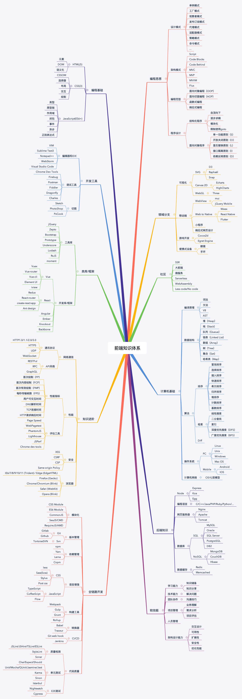

:::info
前端技术日新月异，更是比女孩子的心思变的还快，所以如何应对不断的技术变化与变革，是每个技术人员最关心的事情。有句话说的好，万变不离其宗，所以形成自己的体系，至少要有体系思维，才能再不断的变化中，以不变应万变，去挑战未来的不确定性，做到胸有成竹，心中坦荡，宠若不惊。以下的前端知识体系也许是你需要的，接下来将从脑图谱和文档结构进行编排
:::

--- 
<AutoCatalog />